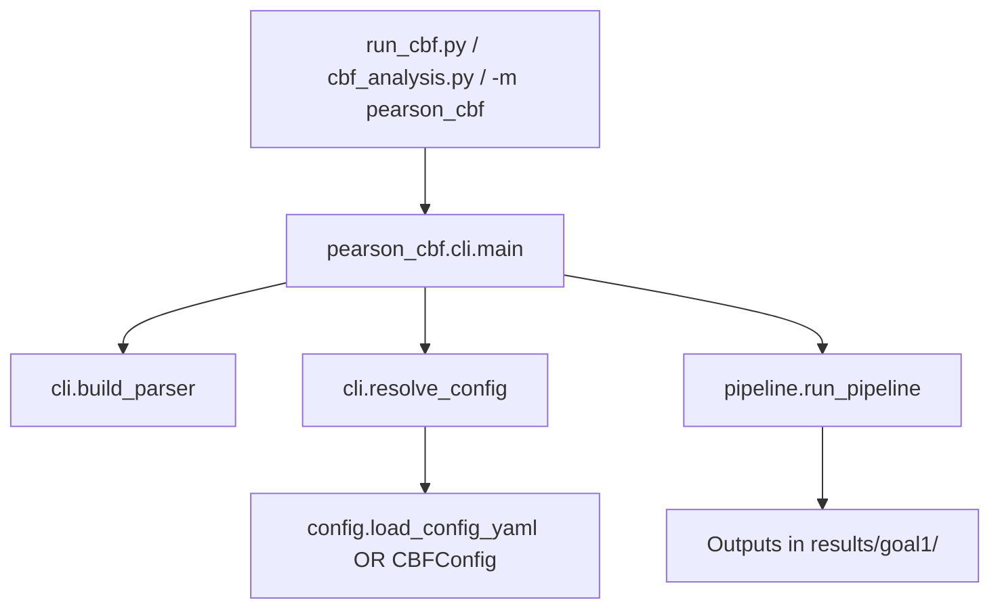

# Master guide — developer workflow (code flow)

**Audience:** Developers, code reviewers, and interns who want to understand *what calls what* in the CBF pipeline.

**Companion docs:**
- [MASTER_GUIDE.md](MASTER_GUIDE.md) — biology, install, how to run (user-facing)
- [PAPER_COMPLIANCE.md](PAPER_COMPLIANCE.md) — alignment with Jeong & Scopulovic papers

**Version:** 1.2.0 | **Author:** Shreeya Malvi | shreeya.malvi@colorado.edu

---

## 1. Entry points (how execution starts)

| You run | What happens |
|---------|----------------|
| `python run_cbf.py ...` | `run_cbf.py` → `pearson_cbf.cli.main()` |
| `python cbf_analysis.py ...` | Same as above (alias) |
| `python -m pearson_cbf ...` | `pearson_cbf/__main__.py` → `cli.main()` |

All paths end in **`cli.main()` → `pipeline.run_pipeline()`**.



---

## 2. Master execution table (Step 1 → Step N)

| Step | Phase | Function / method | File | Input | Output / achievement |
|------|--------|-------------------|------|--------|----------------------|
| **1** | CLI | `main()` | `cli.py` | `sys.argv` | Starts pipeline; exit code 0/1 |
| **2** | CLI | `build_parser()` | `cli.py` | — | Defines `--input`, `--fps`, etc. |
| **3** | CLI | `parse_args()` | `argparse` (stdlib) | argv | `Namespace` of flags |
| **4** | CLI | `resolve_config()` | `cli.py` | args | **`CBFConfig`** object |
| **4a** | Config (if `--config`) | `load_config_yaml()` | `config.py` | `config.yaml` | `CBFConfig` from YAML |
| **4b** | Config (else) | `CBFConfig(...)` | `config.py` | CLI + prompts | `CBFConfig` from flags |
| **5** | Pipeline | `run_pipeline(cfg)` | `pipeline.py` | `CBFConfig` | Orchestrates entire run |
| **6** | Validate | `cfg.validate()` | `config.py` | paths, fps, bands | Raises if invalid |
| **7** | Discover | `discover_files()` | `io_loaders.py` | folder, mode | Sorted list of `.tif` or `.csv` |
| **8** | Manifest | `save_run_manifest()` | `config.py` | `CBFConfig` | **`run_manifest.json`** |
| **9** | Loop start | For each file in list | `pipeline.py` | one path | Log `Video i / n` |
| **10** | Branch | `process_tiff_file` OR `process_csv_file` | `pipeline.py` | path, cfg | Per-file processing |
| **11** | Load data | `load_tif_stack()` OR `load_intensity_csv()` | `io_loaders.py` | file | `(T,Y,X)` array or 1D signal |
| **12** | Genotype | `infer_genotype()` | `genotype.py` | filename | `"WT"`, `"DS"`, or `"Unknown"` |
| **13** | ROIs | `_get_rois()` | `pipeline.py` | first frame, stem | `list[ROI]` |
| **13a** | ROI load | `load_rois()` | `roi_store.py` | `rois/<stem>_rois.json` | Saved boxes (re-run) |
| **13b** | ROI draw | `select_rois_interactive()` | `roi_select.py` | frame + keys n/s/q | New boxes + `save_rois()` |
| **14** | Per ROI loop | For each `ROI` in list | `pipeline.py` | roi | One CBF measurement |
| **15** | Signal | `extract_signal_from_stack()` | `signal_fft.py` | stack, roi | 1D intensity trace (TIFF only) |
| **16** | FFT | `_compute_cbf()` → `compute_cbf()` | `pipeline.py` → `signal_fft.py` | signal, fps, bands | `cbf_hz`, spectrum |
| **16a** | Pre-FFT | `detrend_and_window()` | `signal_fft.py` | trace | Hanning-windowed signal |
| **16b** | FFT core | `rfft()` | `scipy.fft` | windowed signal | Power spectrum |
| **16c** | FreQ-style | `smooth_power_spectrum()` | `signal_fft.py` | power, window=2 | Smoothed spectrum |
| **16d** | Peak pick | `apply_local_sd_peak_mask()` | `signal_fft.py` | band, SD=3 | Masked peak search 10–40 Hz |
| **17** | Plot ROI | `plot_roi_analysis()` | `plots.py` | signal, FFT, roi | **`plots/<stem>_<roi>_analysis.png`** |
| **18** | Store | `CBFResult(...)` append | `models.py` + `pipeline.py` | metrics | Row in memory list |
| **19** | After all files | `results_to_dataframe()` | `pipeline.py` | `list[CBFResult]` | `pandas.DataFrame` |
| **20** | Export | `df.to_csv()` | `pipeline.py` | DataFrame | **`cbf_all_rois.csv`**, `all_cbf_results.csv` |
| **21** | Stats | `run_statistics(df)` | `statistics.py` | all ROIs | Q1a–Q1d summaries |
| **21a** | Q1a | Mann-Whitney, t-test | `statistics.py` | CBF by genotype | `q1a_*` in summary |
| **21b** | Q1b | Levene on per-video SD | `statistics.py` | grouped SD | `q1b_*` in summary |
| **21c** | Q1c | Pairwise \|ΔCBF\| / cell | `statistics.py` | ≥2 ROIs/cell | `cbf_synchrony.csv` |
| **21d** | Q1d | Pearson r distance vs \|ΔCBF\| | `statistics.py` | ROI pairs | `cbf_spatial.csv` |
| **22** | Stats CSV | `to_csv` | `pipeline.py` | summary dict | **`cbf_statistics.csv`** |
| **23** | Figures | `make_summary_figures()` | `plots.py` | df, stats | **`goal1a`–`goal1d` `.png`** |
| **24** | Errors | write `errors.log` | `pipeline.py` | failed files | Optional log if any file failed |
| **25** | Done | `return results_df` | `pipeline.py` | — | DataFrame to caller |

---

## 3. Per-video loop (TIFF mode) — detailed

Applies when `cfg.input_mode == "tiff"` (default).

```
run_pipeline
  └── for each file_path in discover_files(...):
        process_tiff_file(file_path, cfg, all_results)
          ├── load_tif_stack(path)                    → np.ndarray (T, Y, X)
          ├── infer_genotype(path.name)               → "WT" | "DS"
          ├── _get_rois(cfg, stem, stack[0], name)
          │     ├── load_rois(output_dir, stem)       → if JSON exists
          │     └── select_rois_interactive(...)      → else matplotlib UI
          │           └── save_rois(...)              → rois/<stem>_rois.json
          └── for each roi in rois:
                ├── extract_signal_from_stack(stack, roi)
                ├── _compute_cbf(signal, cfg)
                ├── plot_roi_analysis(...)            → plots/*.png
                └── all_results.append(CBFResult(...))
```

**CSV mode** skips steps 13b (no image), 15 (signal already in CSV), and uses `process_csv_file` instead.

---

## 4. Feature → code file map

| Feature / capability | Primary file(s) | Key symbols |
|---------------------|-----------------|-------------|
| Command-line interface | `cli.py` | `main`, `resolve_config`, `build_parser` |
| YAML settings | `config.py` | `CBFConfig`, `load_config_yaml` |
| Run reproducibility log | `config.py` | `save_run_manifest`, `to_manifest` |
| Package version / author | `__about__.py` | `__version__`, `__author__`, `__email__` |
| Public API | `__init__.py` | `run_pipeline`, `CBFConfig` |
| Find input files | `io_loaders.py` | `discover_files` |
| Read TIFF stacks | `io_loaders.py` | `load_tif_stack` |
| Read FIJI Z-profile CSV | `io_loaders.py` | `load_intensity_csv` |
| WT / DS from filename | `genotype.py` | `infer_genotype` |
| ROI data structure | `models.py` | `ROI`, `CBFResult` |
| Interactive ROI drawing | `roi_select.py` | `select_rois_interactive` |
| Save/load ROI JSON | `roi_store.py` | `save_rois`, `load_rois` |
| Intensity trace from video | `signal_fft.py` | `extract_signal_from_stack` |
| FFT + CBF peak (Jeong params) | `signal_fft.py` | `compute_cbf`, `smooth_power_spectrum`, `apply_local_sd_peak_mask` |
| Orchestration | `pipeline.py` | `run_pipeline`, `process_tiff_file`, `process_csv_file` |
| Q1a–Q1d statistics | `statistics.py` | `run_statistics` |
| Diagnostic + summary plots | `plots.py` | `plot_roi_analysis`, `make_summary_figures` |
| Entry script | `run_cbf.py` | imports `cli.main` |
| Legacy entry script | `cbf_analysis.py` | same as `run_cbf.py` |
| Module entry | `__main__.py` | `cli.main()` |
| Conda setup helper | `scripts/setup_conda.ps1` | shell only |

---

## 5. Research question → code path

| Goal | Question | Code that answers it | Output artifact |
|------|----------|----------------------|-----------------|
| **Q1a** | Mean CBF WT vs DS? | `statistics.run_statistics` → Mann-Whitney, t-test | `cbf_statistics.csv`, `goal1a_cbf_comparison.png` |
| **Q1b** | Greater CBF variability in DS? | `statistics` → Levene on `per_file.cbf_sd` | `goal1b_variability.png` |
| **Q1c** | Cilia in sync within one cell? | `statistics` → pairwise \|ΔCBF\| per `(file, cell_id)` | `cbf_synchrony.csv`, `goal1c_synchrony.png` |
| **Q1d** | Spatial coordination between cells? | `statistics` → Pearson r (distance vs \|ΔCBF\|) | `cbf_spatial.csv`, `goal1d_spatial.png` |
| **Core** | CBF per ROI (Hz) | `signal_fft.compute_cbf` | `cbf_all_rois.csv` column `cbf_hz` |
| **QC** | Is this ROI believable? | `plots.plot_roi_analysis` | `plots/<video>_<roi>_analysis.png` |
| **Repro** | Same ROIs on re-run? | `roi_store.load_rois` / `save_rois` | `rois/<stem>_rois.json` |
| **Repro** | What settings were used? | `config.save_run_manifest` | `run_manifest.json` |

---

## 6. Data objects through the pipeline

| Stage | Python type | Fields / notes |
|-------|-------------|----------------|
| Settings | `CBFConfig` | `input_dir`, `output_dir`, `fps`, `freq_min_hz`, … |
| Region | `ROI` | `x, y, w, h`, `label`, `cell_id` |
| One measurement | `CBFResult` | `cbf_hz`, `genotype`, `file`, ROI coords, … |
| All measurements | `list[CBFResult]` | Grows in `run_pipeline` loop |
| Table export | `pd.DataFrame` | Written to CSV |
| Stats bundle | `dict` | `summary`, `per_file`, `synchrony`, `spatial` |

---

## 7. Output files → writing function

| File under `results/goal1/` | Created in |
|----------------------------|------------|
| `run_manifest.json` | `config.save_run_manifest()` — Step 8 |
| `rois/<video>_rois.json` | `roi_store.save_rois()` — Step 13b |
| `plots/<stem>_<roi>_analysis.png` | `plots.plot_roi_analysis()` — Step 17 |
| `cbf_all_rois.csv` | `pipeline.run_pipeline()` — Step 20 |
| `all_cbf_results.csv` | `pipeline.run_pipeline()` — Step 20 (subset of columns) |
| `cbf_statistics.csv` | `pipeline.run_pipeline()` — Step 22 |
| `cbf_synchrony.csv` | `pipeline.run_pipeline()` — Step 22 (if Q1c data exist) |
| `cbf_spatial.csv` | `pipeline.run_pipeline()` — Step 22 (if Q1d data exist) |
| `goal1a_cbf_comparison.png` | `plots.make_summary_figures()` — Step 23 |
| `goal1b_variability.png` | `plots.make_summary_figures()` — Step 23 |
| `goal1c_synchrony.png` | `plots.make_summary_figures()` — Step 23 |
| `goal1d_spatial.png` | `plots.make_summary_figures()` — Step 23 |
| `errors.log` | `pipeline.run_pipeline()` — Step 24 (only if some files failed) |

---

## 8. Dependency graph (modules only)

```
run_cbf.py
  └── pearson_cbf.cli
        ├── pearson_cbf.config
        │     └── pearson_cbf.__about__
        └── pearson_cbf.pipeline
              ├── pearson_cbf.config
              ├── pearson_cbf.io_loaders
              ├── pearson_cbf.genotype
              ├── pearson_cbf.models
              ├── pearson_cbf.roi_select
              ├── pearson_cbf.roi_store
              ├── pearson_cbf.signal_fft  → scipy, numpy
              ├── pearson_cbf.plots       → matplotlib
              └── pearson_cbf.statistics  → scipy, pandas
```

**External libraries:** `numpy`, `pandas`, `scipy`, `matplotlib`, `tifffile`, `yaml` (PyYAML).

---

## 9. What is *not* in this codebase

| Capability | Where it lives |
|------------|----------------|
| FIJI drift correction (MultiStackReg) | Manual — see `FIJI_PREP.md` |
| FreQ per-pixel heatmaps | FIJI plugin — see `FIJI_PREP.md` |
| Bead tracking (Goal 2) | Future pipeline / TrackMate |
| Centriole analysis (Goal 3) | Future pipeline |
| R `lme4` mixed models | External R script on `cbf_all_rois.csv` |

---

## 10. How to trace a bug (developer checklist)

| Symptom | Check module | Likely cause |
|---------|--------------|--------------|
| Wrong CBF (~5 or ~60 Hz) | `config` / user `--fps` | fps mismatch vs FIJI |
| `Unknown` genotype | `genotype.py` | filename missing `wt`/`ds` |
| Q1c skipped | `roi_select` / `statistics` | &lt;2 ROIs per cell (need `s` key) |
| No ROI file on re-run | `roi_store` | first run not completed; JSON missing |
| Empty FFT peak | `signal_fft` | bad ROI (background), or fps too low |
| File fails but run continues | `pipeline` | see `errors.log` |
| Import error | install | run `pip install -e .` from repo root |

---

## 11. Suggested reading order for new developers

1. `models.py` — data shapes (5 min)
2. `signal_fft.py` — core science/math (15 min)
3. `pipeline.py` — full orchestration (20 min)
4. `cli.py` — how users start the run (10 min)
5. `statistics.py` + `plots.py` — Q1a–Q1d (15 min)

Then run once with 1–2 videos and set breakpoints in `process_tiff_file` and `compute_cbf`.

---

*Document: `MASTER_GUIDE_DEVELOPER.md` | Pearson Lab Goal 1 CBF | v1.2.0*
